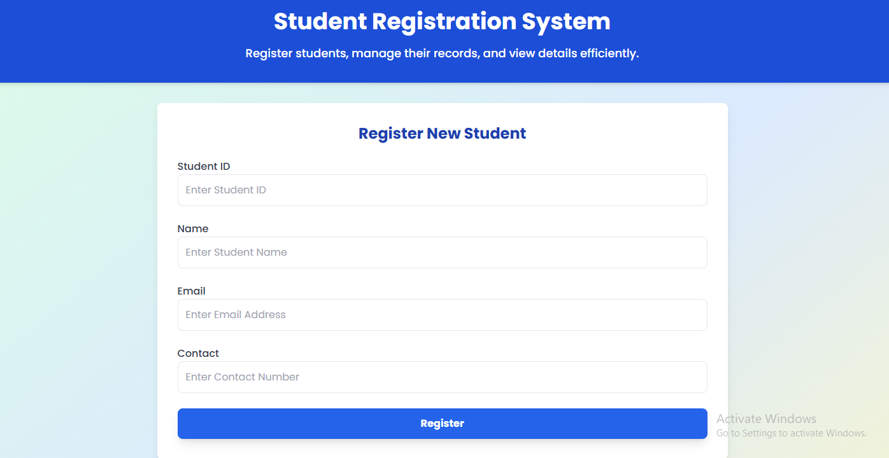
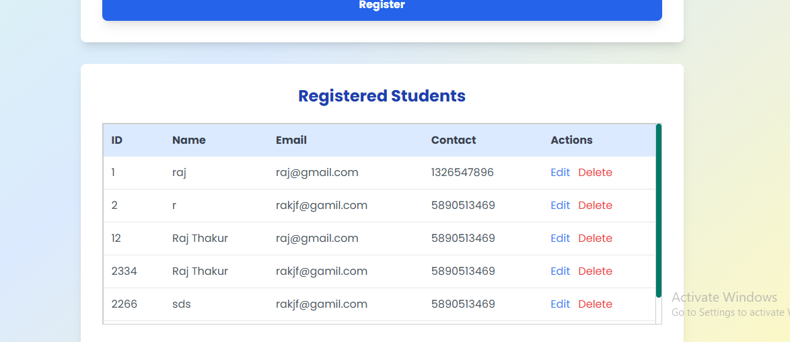

# 🎓 Student Registration System

A modern and responsive **Student Registration System** built using **HTML**, **Tailwind CSS**, and **JavaScript**.

## 🚀 Features

- 📥 Register new students with ID, name, email, and contact
- ✏️ Edit or delete student details dynamically
- 💾 Stores data locally using **localStorage**
- 📱 Fully responsive design using **Tailwind CSS**

## 📸 Screenshots

### 1. Registration Form


### 2. Student Records Table


## 💻 How to Use

1. Clone the repository:
   ```bash
   git clone https://github.com/Raj-2151-raj/student-registration-system.git
